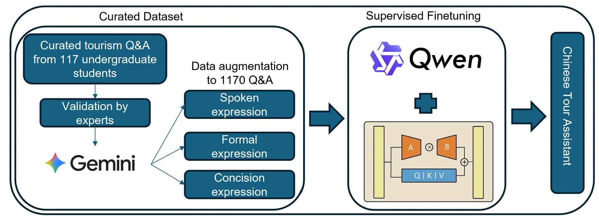
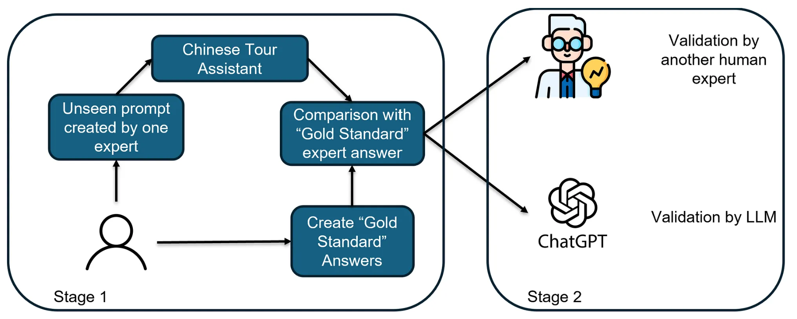

# Chengdu Tourism Chinese Assistant with QLoRA

<p align="center">
  <b>A domain-specific Chinese tourism assistant built under severe data scarcity using controlled augmentation, QLoRA-based supervised fine-tuning, and multi-stage evaluation.</b>
</p>

<p align="center">
  <a href="https://medium.com/mitb-for-all/building-a-domain-specific-chinese-tourism-assistant-from-data-scarcity-to-fine-tuning-685ac7832f79">Article</a> •
  <a href="genai_finetune.pptx">Slides</a>
</p>

---

## Overview

This repository documents an applied case study on adapting a compact open-weight language model into a more useful **city-specific Chinese tourism assistant**.

The project focuses on **Chengdu, China** and investigates whether a compact model can be aligned to produce more locally relevant and practically useful responses using:

- a small curated tourism Q&A dataset
- controlled stylistic augmentation
- QLoRA-based supervised fine-tuning
- a two-stage evaluation workflow

This repository is intended as a **research and implementation companion** to the article and project slides.

---

## Method Overview

### 1. Curated dataset construction

A Chengdu-specific Chinese tourism Q&A dataset was curated to reflect realistic visitor questions and responses in a narrow destination domain.

### 2. Controlled augmentation

To reduce overfitting to limited phrasing patterns, each seed tourism Q&A pair was rewritten into controlled stylistic variants such as:

- spoken expression
- formal expression
- concise expression

This increases linguistic diversity while preserving the original tourism intent.

### 3. Supervised fine-tuning with QLoRA

A compact Qwen instruction model was adapted using QLoRA.  
The objective was not to reteach general Chinese language ability, but to steer the model toward:

- stronger local relevance
- better tourism-task usefulness
- more consistent response behavior

### 4. Multi-stage evaluation

The project uses a two-stage evaluation design:

- **Stage 1:** expert-authored unseen prompts and gold-standard reference answers
- **Stage 2:** independent validation by another human expert and an LLM judge

For findings and discussion, please refer to the article and slides.

---

## Figures

### Augmentation and Fine-tuning Pipeline



### Evaluation Workflow



---

## Code and Resources

### Data preparation
- `data_preparation/augment_via_LLM.ipynb`
- `data_preparation/extract_from_excel.ipynb`

### Training
- `chengdu_tourism_zh_qwen3_4b_instruct_sft_qlora_v7.ipynb`

### Evaluation
- `testing_and_result/multi_ref_eval.ipynb`
- `testing_and_result/llm_judge.ipynb`
- `testing_and_result/test_inference.ipynb`
- `testing_and_result/Ploting-human.ipynb`

### Additional material
- `genai_finetune.pptx`

---

## Repository Structure

```text
.
├── data_preparation/
│   ├── augment_via_LLM.ipynb
│   ├── extract_from_excel.ipynb
│   ├── train.jsonl
│   └── train_merged_appended.jsonl
│
├── testing_and_result/
│   ├── comparison_fix.ipynb
│   ├── comparison_temp.ipynb
│   ├── llm_judge.ipynb
│   ├── multi_ref_eval.ipynb
│   ├── test_inference.ipynb
│   └── Ploting-human.ipynb
│
├── chengdu_tourism_zh_qwen3_4b_instruct_sft_qlora_v7.ipynb
├── genai_finetune.pptx
└── README.md
```
---

## Getting Started

Recommended entry points for readers:

1. `data_preparation/augment_via_LLM.ipynb`  
   For the controlled augmentation workflow.

2. `chengdu_tourism_zh_qwen3_4b_instruct_sft_qlora_v7.ipynb`  
   For supervised fine-tuning with QLoRA.

3. `testing_and_result/llm_judge.ipynb` and `testing_and_result/multi_ref_eval.ipynb`  
   For the evaluation pipeline.

---

## Scope

This repository should be interpreted as:

- an applied case study
- a narrow-domain adaptation workflow
- a resource-constrained fine-tuning example
- a research-oriented implementation companion

It should not be interpreted as a full production tourism platform.

---

## Acknowledgement

I would like to express my sincere gratitude to **Associate Professor Shang Wei** and his team from **Chengdu University of Information Technology** for their valuable data support for this project.

## Links

- **Article:** `https://medium.com/mitb-for-all/building-a-domain-specific-chinese-tourism-assistant-from-data-scarcity-to-fine-tuning-685ac7832f79`
- **Slides:** `genai_finetune.pptx`
